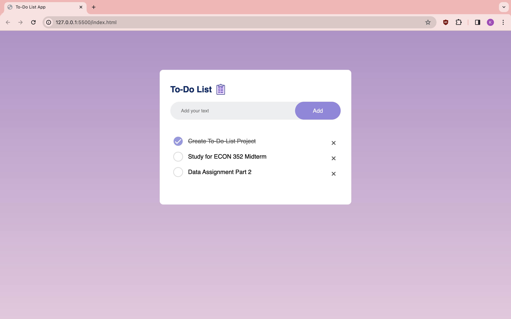

# To-Do List Web Application

## Introduction
This **To-Do List Web Application** is designed to help users manage their daily tasks efficiently. It provides a simple and intuitive interface for adding, completing, and removing tasks. Built with **HTML**, **CSS**, and **JavaScript**.

## Features
- **Add Tasks:** Users can add new tasks to their to-do list with a simple input field and an "Add" button.
- **Complete Tasks:** Click on a task to mark it as completed, visually indicating that the task is done.
- **Delete Tasks:** Each task has a delete button that allows users to remove tasks from the list.
- **Persistent Storage:** Tasks are stored locally in the browser, ensuring that users don't lose their data between sessions.
- **Responsive Design:** The application is fully responsive, providing an optimal viewing experience across a wide range of devices.

## Getting Started

### Prerequisites
A modern web browser capable of running HTML, CSS, and JavaScript.

### Installation

1. **Clone the repository:**
   ```bash
   git clone https://github.com/klsuu/todo-list.git

2. **Navigate to the project directory:**
    ```bash
    cd todo-list
3. **Open the application:**
    Open the index.html file in your web browser.

### Application Preview

Here's a look at the To-Do List Web Application in action:



